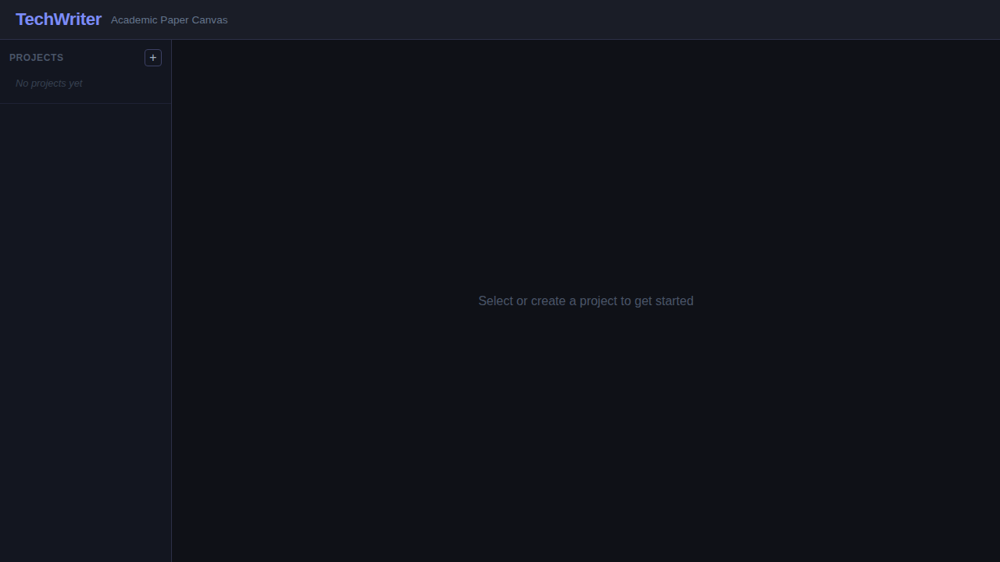

# TechWriter

**Academic Paper Canvas Architect** — a full-stack web application for managing and writing academic papers with a visual, canvas-based interface.


## Features

- **Project Management** — Create and switch between multiple research paper projects.
- **Visual Canvas** — Interactive node-based canvas (powered by [React Flow](https://reactflow.dev)) that visualises paper sections and their relationships. Drag nodes to reposition them.
- **Section Editor** — Built-in Markdown editor for writing and editing paper sections with real-time save.
- **LLM-Powered Generation** — Generate section drafts using an OpenAI-compatible API, with structured template fallback when no API key is configured.
- **Validation & Consistency Checking** — Validate sections against Research Questions (RQs), detect missing RQ references, and check terminology consistency across your paper.
- **Predefined Section Types** — Introduction, Data Preparation, Research Questions, Methodology, Results, Discussion, Related Work, Conclusion, and Glossary, each with its own icon and colour.

## Screenshots

### Landing Page

The starting view with the project sidebar and empty canvas.



### Generate Section Modal

Create new sections by choosing a type, optionally naming it, and providing additional context for the LLM.


### Canvas with Section Editor

After generating sections they appear as draggable nodes on the canvas. Selecting a node opens the Markdown editor on the right.


### Validation Results

Run validation on any section to check alignment with your Research Questions and terminology consistency.


## Tech Stack

| Layer | Technology |
|-------|-----------|
| Frontend | React 18, Vite, [React Flow](https://reactflow.dev) |
| Backend | Python, FastAPI, Uvicorn |
| LLM Integration | OpenAI-compatible API (optional) |
| Storage | File-based (Markdown files + JSON metadata) |

## Getting Started

### Prerequisites

- Python 3.10+
- Node.js 16+
- npm

### Backend

```bash
cd backend
pip install -r requirements.txt
uvicorn main:app --reload
```

The API server starts at `http://localhost:8000`. Interactive API docs are available at `http://localhost:8000/docs`.

> **Note:** Run `uvicorn` from the project root with `python -m uvicorn backend.main:app --reload` if you encounter module import errors.

### Frontend

```bash
cd frontend
npm install
npm run dev
```

The development server starts at `http://localhost:5173` and proxies API requests to the backend.

### Environment Variables (optional)

| Variable | Description | Default |
|----------|-------------|---------|
| `OPENAI_API_KEY` | OpenAI API key for LLM generation | _(empty — uses template fallback)_ |
| `OPENAI_API_BASE` | OpenAI-compatible API base URL | `https://api.openai.com/v1` |
| `LLM_MODEL` | Model name to use for generation | `gpt-4o` |

## Project Structure

```
TechWriter/
├── backend/
│   ├── main.py                  # FastAPI application entry point
│   ├── models.py                # Pydantic data models
│   ├── requirements.txt         # Python dependencies
│   ├── routers/
│   │   ├── projects.py          # Project CRUD endpoints
│   │   ├── sections.py          # Section CRUD endpoints
│   │   ├── canvas.py            # Canvas metadata & node positioning
│   │   ├── generate.py          # LLM-powered section generation
│   │   └── validate.py          # Section validation & consistency
│   ├── services/
│   │   ├── file_service.py      # File I/O & project management
│   │   ├── llm_service.py       # LLM generation with template fallback
│   │   └── consistency_service.py # RQ & terminology validation
│   └── tests/
│       ├── test_sections.py     # Section CRUD tests
│       ├── test_generate.py     # Generation tests
│       ├── test_canvas.py       # Canvas tests
│       └── test_validate.py     # Validation tests
├── frontend/
│   ├── package.json
│   ├── vite.config.js           # Vite config with API proxy
│   └── src/
│       ├── App.jsx              # Main application component
│       ├── components/
│       │   ├── Canvas.jsx       # React Flow canvas visualisation
│       │   ├── Sidebar.jsx      # Project & section navigation
│       │   ├── NodeEditor.jsx   # Markdown section editor
│       │   ├── SectionNode.jsx  # Individual canvas node component
│       │   └── GenerateModal.jsx # Section generation dialog
│       └── services/
│           └── api.js           # Axios API client
└── docs/
    └── screenshots/             # Application screenshots
```

## Running Tests

```bash
cd backend
pytest -v
```

## API Endpoints

| Method | Endpoint | Description |
|--------|----------|-------------|
| `GET` | `/projects/` | List all projects |
| `POST` | `/projects/` | Create a new project |
| `GET` | `/projects/{project}/sections/` | List sections in a project |
| `GET` | `/projects/{project}/sections/{name}` | Get section content |
| `POST` | `/projects/{project}/sections/{name}` | Create a section |
| `PUT` | `/projects/{project}/sections/{name}` | Update section content |
| `DELETE` | `/projects/{project}/sections/{name}` | Delete a section |
| `GET` | `/projects/{project}/canvas/` | Get canvas metadata |
| `PUT` | `/projects/{project}/canvas/` | Update canvas metadata |
| `PATCH` | `/projects/{project}/canvas/nodes/{id}/position` | Move a canvas node |
| `POST` | `/projects/{project}/generate/` | Generate a section via LLM |
| `POST` | `/projects/{project}/validate/section` | Validate a section |
| `POST` | `/projects/{project}/validate/consistency` | Check terminology consistency |
| `GET` | `/health` | Health check |

## License

This project is provided as-is for academic and research purposes.