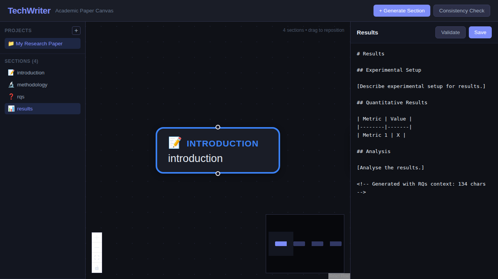
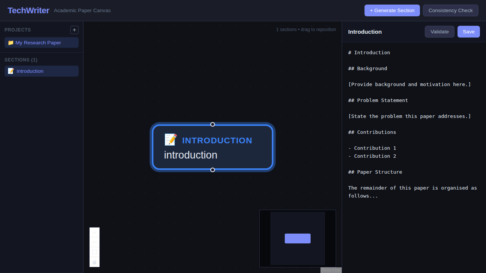
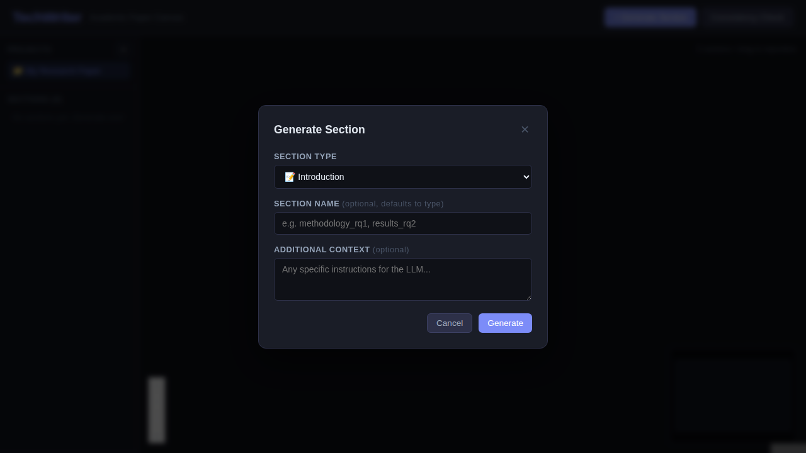
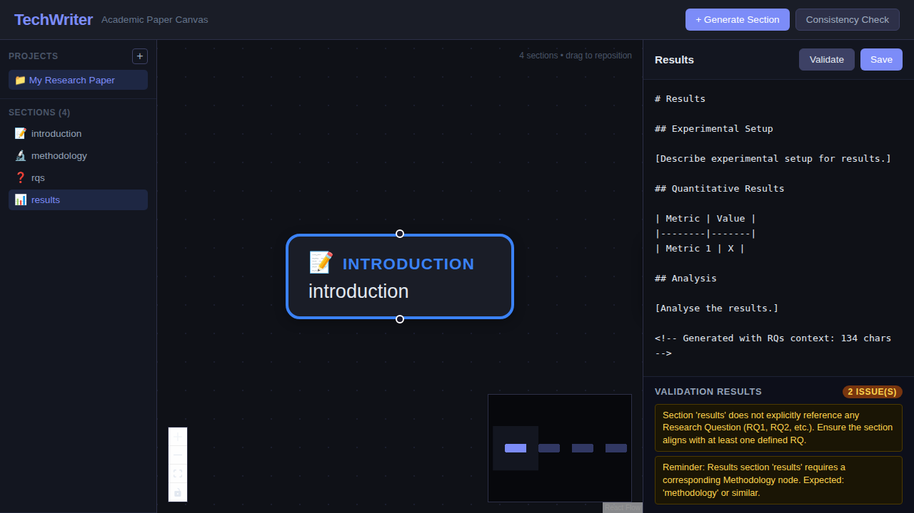

# Agent Guide — TechWriter

This document provides context and conventions for AI coding agents working on the TechWriter codebase.

## Project Overview

TechWriter is an **Academic Paper Canvas Architect**: a full-stack web application that helps researchers manage and write academic papers through a visual, canvas-based interface.



### Core Concepts

| Concept | Description |
|---------|-------------|
| **Project** | A named container for an academic paper. Stored as a directory under `backend/projects/`. |
| **Section** | A Markdown file within a project (e.g. `introduction.md`, `methodology.md`). |
| **Canvas** | An interactive node graph where each node represents a section. Metadata stored in `canvas_meta.json`. |
| **Generation** | Creating section drafts via an OpenAI-compatible LLM or a built-in template fallback. |
| **Validation** | Checking sections against Research Questions (RQs) and glossary terms for consistency. |

## Architecture

```
┌──────────────────────────────────────────────────────────┐
│  Frontend (React 18 + Vite)                              │
│  ┌──────────┐ ┌───────────┐ ┌────────────┐ ┌──────────┐ │
│  │ Sidebar  │ │  Canvas   │ │ NodeEditor │ │ Generate │ │
│  │          │ │(ReactFlow)│ │            │ │  Modal   │ │
│  └──────────┘ └───────────┘ └────────────┘ └──────────┘ │
│                      │  Axios (/api proxy)               │
├──────────────────────┼───────────────────────────────────┤
│  Backend (FastAPI)   ▼                                   │
│  ┌──────────────────────────────────────────────────────┐│
│  │  Routers: projects │ sections │ canvas │ generate │  ││
│  │           validate                                   ││
│  ├──────────────────────────────────────────────────────┤│
│  │  Services: file_service │ llm_service │              ││
│  │            consistency_service                       ││
│  ├──────────────────────────────────────────────────────┤│
│  │  Storage: projects/{name}/sections/*.md              ││
│  │           projects/{name}/canvas_meta.json           ││
│  └──────────────────────────────────────────────────────┘│
└──────────────────────────────────────────────────────────┘
```

## Tech Stack

- **Frontend:** React 18, Vite 5, `@xyflow/react` (React Flow) 12, Axios
- **Backend:** Python 3.10+, FastAPI 0.111, Uvicorn 0.29, Pydantic 2.7
- **Testing:** pytest 8 + pytest-asyncio 0.23
- **LLM:** OpenAI-compatible API (optional, template fallback included)

## Key Files

| File | Purpose |
|------|---------|
| `backend/main.py` | FastAPI app setup, CORS, router registration |
| `backend/models.py` | All Pydantic models (Section, CanvasNode, GenerateRequest, etc.) |
| `backend/routers/projects.py` | Project CRUD (list, create) |
| `backend/routers/sections.py` | Section CRUD (list, get, create, update, delete) |
| `backend/routers/canvas.py` | Canvas metadata & node positioning |
| `backend/routers/generate.py` | LLM-powered section generation |
| `backend/routers/validate.py` | Section validation & terminology consistency |
| `backend/services/file_service.py` | All file I/O operations |
| `backend/services/llm_service.py` | LLM integration with template fallback |
| `backend/services/consistency_service.py` | RQ reference & terminology checking |
| `frontend/src/App.jsx` | Main React component, state management, event handlers |
| `frontend/src/components/Canvas.jsx` | React Flow canvas with node layout logic |
| `frontend/src/components/Sidebar.jsx` | Project list & section navigation |
| `frontend/src/components/NodeEditor.jsx` | Markdown editor with validate/save controls |
| `frontend/src/components/SectionNode.jsx` | Individual canvas node component |
| `frontend/src/components/GenerateModal.jsx` | Modal dialog for section generation |
| `frontend/src/services/api.js` | Axios API client (all endpoint calls) |
| `frontend/vite.config.js` | Vite config with `/api` → backend proxy |

## UI Layout

The application uses a three-panel layout:



1. **Left sidebar** — project list and section navigation
2. **Centre canvas** — interactive React Flow graph of paper sections
3. **Right editor panel** — Markdown editor for the selected section, with Validate and Save buttons

### Section Generation

Sections are generated through a modal dialog:



### Section Validation

Each section can be validated against the paper's Research Questions:



## Conventions

### Backend

- **Router prefix pattern:** All routers use a prefix under `/projects/` (except health check at `/health`).
- **Imports:** Backend modules use absolute imports from the `backend` package (e.g. `from backend.models import ...`).
- **Running the server:** Use `python -m uvicorn backend.main:app --reload` from the project root, or `cd backend && uvicorn main:app --reload` only if you adjust imports.
- **Async:** All route handlers and service functions that perform I/O are `async`.
- **Models:** All request/response bodies use Pydantic models defined in `backend/models.py`.
- **Storage:** Projects are stored at `backend/projects/{project_name}/`. Sections are Markdown files in a `sections/` subdirectory. Canvas layout is in `canvas_meta.json`.
- **LLM fallback:** When `OPENAI_API_KEY` is not set, `llm_service.py` returns structured templates instead of calling the API.

### Frontend

- **API client:** All API calls go through `frontend/src/services/api.js`. The Vite dev server proxies `/api` to `http://localhost:8000` with the `/api` prefix stripped.
- **State management:** Uses React `useState`/`useEffect` hooks in `App.jsx` — no external state library.
- **Styling:** Plain CSS files co-located with components (e.g. `Canvas.css`, `Sidebar.css`). Dark theme with GitHub-inspired colours.
- **Component pattern:** Functional components with props. No class components.
- **Section types:** Nine predefined types with emoji icons: `introduction` (📝), `data_preparation` (💾), `rqs` (❓), `methodology` (🔬), `results` (📊), `discussion` (💬), `related_work` (🔗), `conclusion` (🎯), `glossary` (📚).

### Testing

- Tests live in `backend/tests/` and use `pytest` with `pytest-asyncio`.
- Tests use `httpx.AsyncClient` with `ASGITransport` to test FastAPI endpoints.
- Each test creates and cleans up its own project directory.
- Run tests with `cd backend && pytest -v`.

## Development Workflow

```bash
# Terminal 1 — Backend
cd backend
pip install -r requirements.txt
uvicorn main:app --reload          # http://localhost:8000

# Terminal 2 — Frontend
cd frontend
npm install
npm run dev                        # http://localhost:5173

# Run backend tests
cd backend
pytest -v
```

## Environment Variables

| Variable | Description | Default |
|----------|-------------|---------|
| `OPENAI_API_KEY` | API key for LLM generation | _(empty — uses template fallback)_ |
| `OPENAI_API_BASE` | OpenAI-compatible API base URL | `https://api.openai.com/v1` |
| `LLM_MODEL` | Model name for generation | `gpt-4o` |
